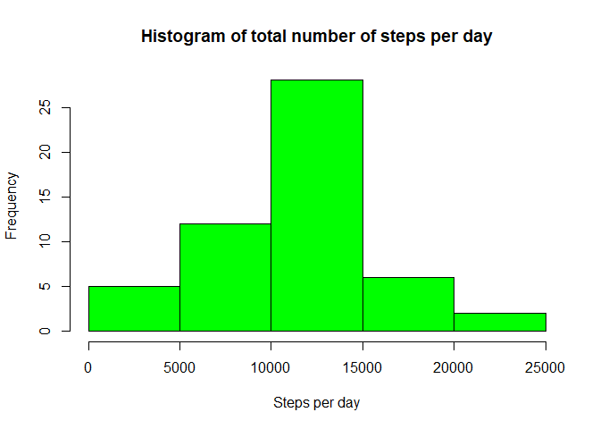
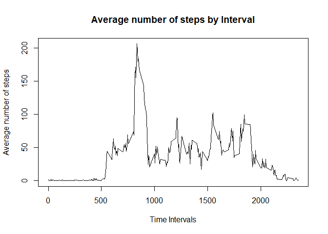
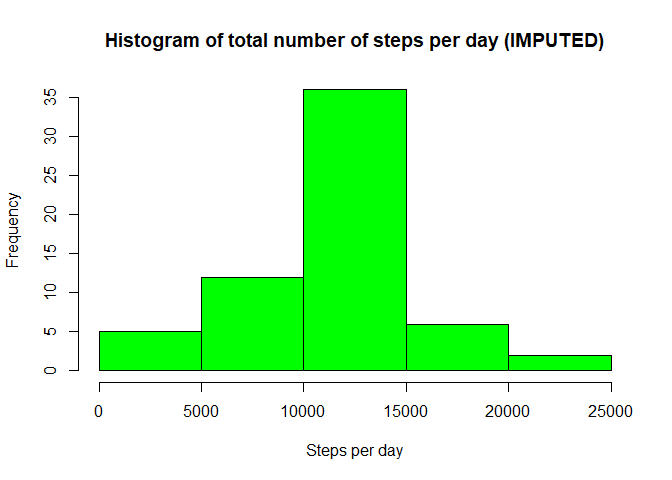
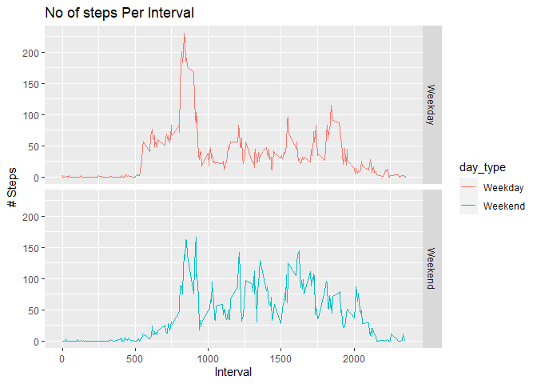

This R markdown document was built with R version 3.6.3

Second revision, to allow GitHub integration 

# Peer-graded Assignment: Course Project 1
## Introduction

It is now possible to collect a large amount of data about personal movement using activity monitoring devices such as a Fitbit, Nike Fuelband, or Jawbone Up. These type of devices are part of the "quantified self" movement - a group of enthusiasts who take measurements about themselves regularly to improve their health, to find patterns in their behavior, or because they are tech geeks. But these data remain under-utilized both because the raw data are hard to obtain and there is a lack of statistical methods and software for processing and interpreting the data.

This assignment makes use of data from a personal activity monitoring device. This device collects data at 5 minute intervals through out the day. The data consists of two months of data from an anonymous individual collected during the months of October and November, 2012 and include the number of steps taken in 5 minute intervals each day.

The data for this assignment can be downloaded from the course web site.
The variables included in this dataset are as follows:

1. steps: Number of steps taking in a 5-minute interval (missing values are coded as NA)
2. date: The date on which the measurement was taken in YYYY-MM-DD format
3. interval: Identifier for the 5-minute interval in which measurement was taken

The dataset is stored in a comma-separated-value (CSV) file and there are a total of 17,568 observations in this dataset.

##Loading and preprocessing the data

Show any code that is needed to

1. Load the data (i.e.read.csv)
2. Process/transform the data (if necessary) into a format suitable for your analysis


```r
setwd("H:/Joe/Data Science/Coursera/5 - Reproducible Research/RR - Course Project 1")
MyFile <- "activity.csv"
# Load the data file into a data frame
activity <- read.csv(MyFile, as.is = TRUE)
# Remove the NA values and store in a separate structure for future use
good_act <- activity[complete.cases(activity), ]
```

##What is mean total number of steps taken per day?
For this part of the assignment, you can ignore the missing values in the dataset.

####Calculate the total number of steps taken per day

```r
steps_per_day <- aggregate(steps ~ date, good_act, sum)
```
If you do not understand the difference between a histogram and a barplot, research the difference between them. Make a histogram of the total number of steps taken each day

#### Create a histogram of no of steps per day

```r
hist(steps_per_day$steps, main = "Histogram of total number of steps per day", xlab = "Steps per day", col="Green")
```

<!-- -->

####Calculate and report the mean and median of the total number of steps taken per day
The mean and median data is shown in the following summary


```r
summary(steps_per_day)
```

```
##      date               steps      
##  Length:53          Min.   :   41  
##  Class :character   1st Qu.: 8841  
##  Mode  :character   Median :10765  
##                     Mean   :10766  
##                     3rd Qu.:13294  
##                     Max.   :21194
```


##What is the average daily activity patten?
####Make a time series plot (i.e. type = "l") of the 5-minute interval (x-axis) and the average number of steps taken, averaged across all days (y-axis)

First, let us calculate the average steps per interval for all days 

```r
avg_steps_per_interval <- aggregate(steps ~ interval, good_act, mean)
```
Plot the time series with appropriate labels and heading

```r
plot(avg_steps_per_interval$interval, avg_steps_per_interval$steps, type='l', col=1, main="Average number of steps by Interval", xlab="Time Intervals", ylab="Average number of steps")
```

<!-- -->

#### Which 5-minute interval, on average across all the days in the dataset, contains the maximum number of steps?
We need to identify the interval index which has the highest average steps

```r
interval_idx <- which.max(avg_steps_per_interval$steps)
```
Identify the specific interval and the average steps for that interval

```r
print (paste("The interval with highest avg. steps is", avg_steps_per_interval[interval_idx, ]$interval, "and the step number for that interval is", round(avg_steps_per_interval[interval_idx, ]$steps, digits = 1)))
```

```
## [1] "The interval with highest avg. steps is 835 and the step number for that interval is 206.2"
```


## Imputing missing values

Note that there are a number of days/intervals where there are missing values (coded as NA). The presence of missing days may introduce bias into some calculations or summaries of the data.

#### Calculate and report the total number of missing values in the dataset (i.e. the total number of rows with NAs)

```r
missing_value_act <- activity[!complete.cases(activity), ]
nrow(missing_value_act)
```

```
## [1] 2304
```

####  Devise a strategy for filling in all of the missing values in the dataset. The strategy does not need to be sophisticated. For example, you could use the mean/median for that day, or the mean for that 5-minute interval, etc.

There are some options here. After reflection, the chosen strategy is as follows

1. Calculate the number of mean steps
2. Perform a loop through of all of the rows of activity in order to detect the steps = NA row(s).
3. Those rows need to have the interval identified. 
4. Move on to subsequently identify the avg steps for that interval in avg_steps_per_interval
5. Substitute the NA value with the calculated avg steps.


```r
for (i in 1:nrow(activity)) {
            if(is.na(activity$steps[i])) {
                        val <- avg_steps_per_interval$steps[which(avg_steps_per_interval$interval == activity$interval[i])]
                        activity$steps[i] <- val 
            }
}
```

Aggregate the steps per day with the imputed values


```r
steps_per_day_impute <- aggregate(steps ~ date, activity, sum)
```

Draw a histogram of the value


```r
hist(steps_per_day_impute$steps, main = "Histogram of total number of steps per day (IMPUTED)", xlab = "Steps per day", col="Green")
```

<!-- -->

Compute the mean and median of the imputed value
Calculate the mean and median of the total number of steps taken per day

The mean and median data is shown in the following summary


```r
summary(steps_per_day)
```

```
##      date               steps      
##  Length:53          Min.   :   41  
##  Class :character   1st Qu.: 8841  
##  Mode  :character   Median :10765  
##                     Mean   :10766  
##                     3rd Qu.:13294  
##                     Max.   :21194
```

```r
summary(steps_per_day_impute)
```

```
##      date               steps      
##  Length:61          Min.   :   41  
##  Class :character   1st Qu.: 9819  
##  Mode  :character   Median :10766  
##                     Mean   :10766  
##                     3rd Qu.:12811  
##                     Max.   :21194
```

##Are there differences in activity patterns between weekdays and weekends?

For this part the weekdays function may be of some help here. Use the dataset with the filled-in missing values for this part.

####Create a new factor variable in the dataset with two levels - "weekday" and "weekend" indicating whether a given date is a weekday or weekend day.


```r
#
week_day <- function(date_val) {
            wd <- weekdays(as.Date(date_val, '%Y-%m-%d'))
            if  (!(wd == 'Saturday' || wd == 'Sunday')) {
                        x <- 'Weekday'
            } else {
                        x <- 'Weekend'
            }
            x
}
```

Apply the week_day function and add a new column to activity dataset


```r
activity$day_type <- as.factor(sapply(activity$date, week_day))
```

Make a panel plot containing a time series plot (i.e. type = "l") of the 5-minute interval (x-axis) and the average number of steps taken, averaged across all weekday days or weekend days (y-axis). See the README file in the GitHub repository to see an example of what this plot should look like using simulated data.


```r
#load the ggplot library
library(ggplot2)
# Create the aggregated data frame by intervals and day_type
steps_per_day_impute <- aggregate(steps ~ interval+day_type, activity, mean)
# Create the plot
plt <- ggplot(steps_per_day_impute, aes(interval, steps)) +
            geom_line(stat = "identity", aes(colour = day_type)) +
            theme_gray() +
            facet_grid(day_type ~ ., scales="fixed", space="fixed") +
            labs(x="Interval", y=expression("# Steps")) +
            ggtitle("No of steps Per Interval")
print(plt)
```

<!-- -->

There are some differences in the activity pattens, which are apparent in the plot.

1. The Weekend interval starts later (one inference is that the wearer is less active in the early part of the weekend)
2. The total number of steps is higher on weekdays


# End of document
